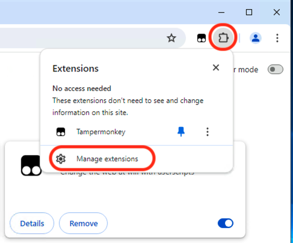
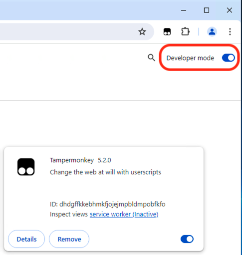
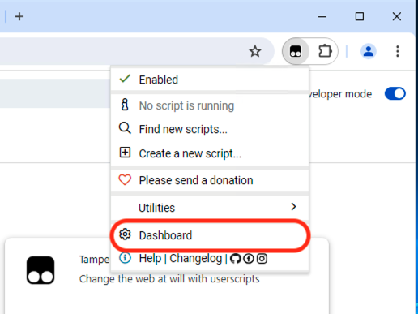
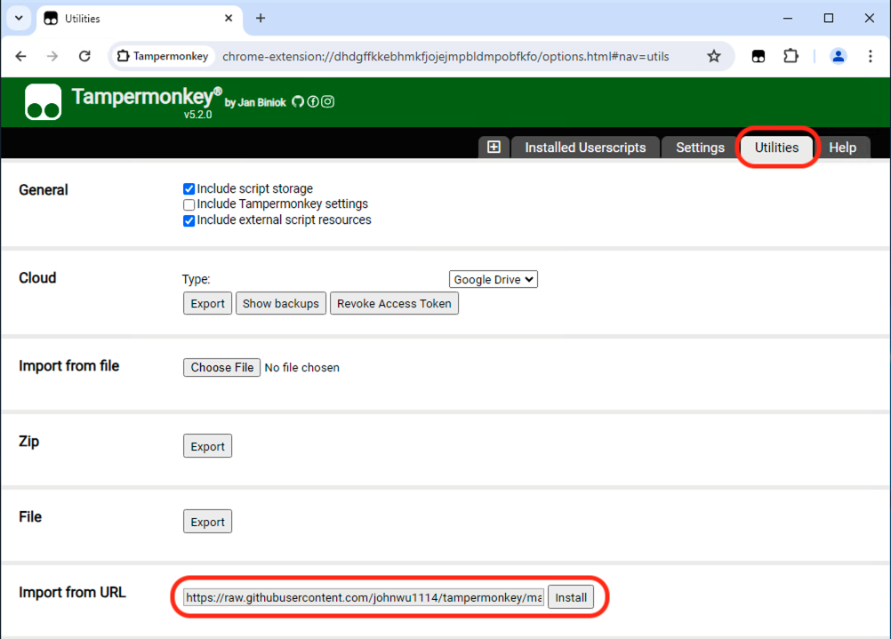
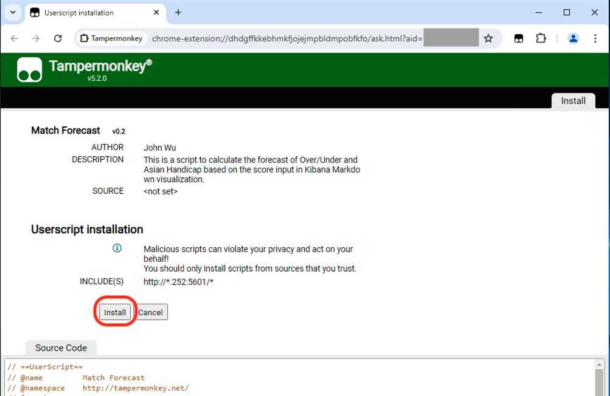
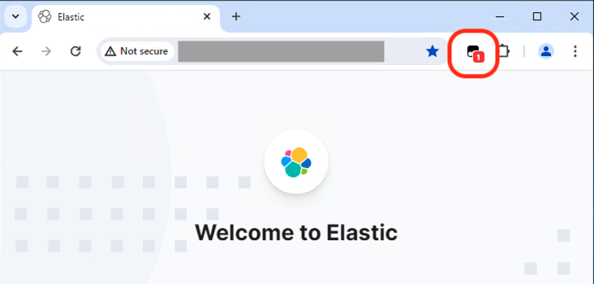
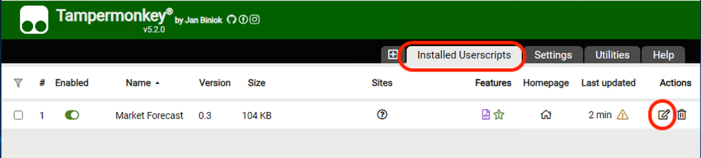
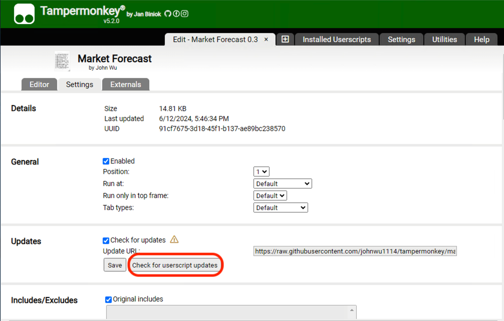
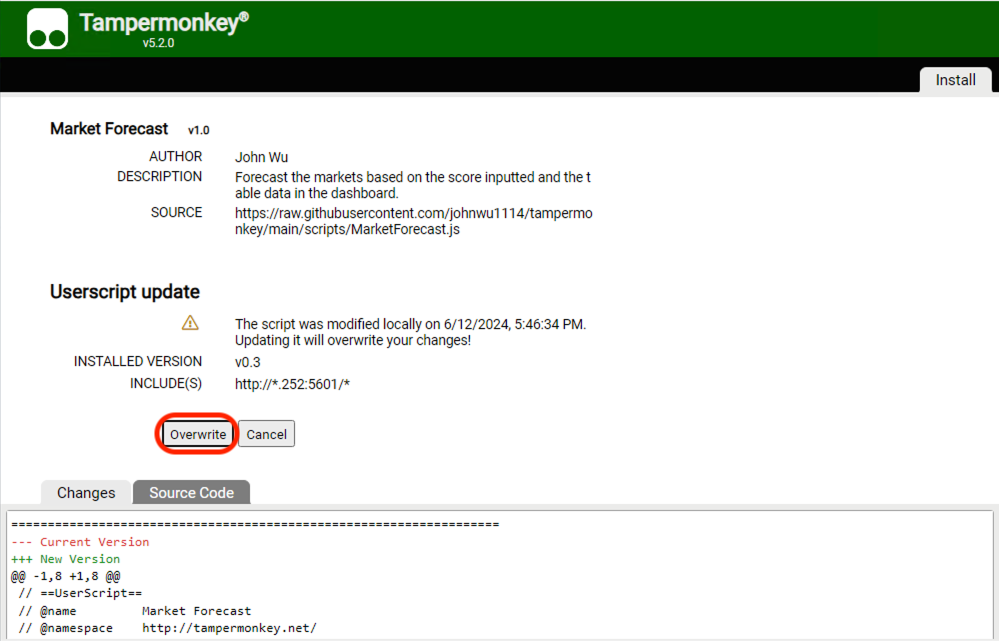

# Get Started

This script is based on the [Tampermonkey](https://www.tampermonkey.net/#google_vignette) plugin and runs with the Kibana Dashboard "Market Forecast".

## Install Tampermonkey

1. Install the [Tampermonkey Extension](https://chrome.google.com/webstore/detail/dhdgffkkebhmkfjojejmpbldmpobfkfo) on Chrome.
2. Turn on developer mode and follow the steps below:  

     
     

3. Reopen Chrome.

## Import Scripts

1. Go to the Tampermonkey [Utilities](chrome-extension://dhdgffkkebhmkfjojejmpbldmpobfkfo/options.html#nav=utils) page.

     

2. Import the script from the URL by following the steps below:  
   > Script URL: https://raw.githubusercontent.com/johnwu1114/tampermonkey/main/scripts/MarketForecast.js  
     
     

3. Reload the page on Kibana. A count will be shown on the Tampermonkey Extension.

     

## Update Script

1. Go to the Tampermonkey [Utilities](chrome-extension://dhdgffkkebhmkfjojejmpbldmpobfkfo/options.html#nav=utils) page.

     

2. Edit Installed Script

     

3. Check Updates 

     

4. Overwrite

     

